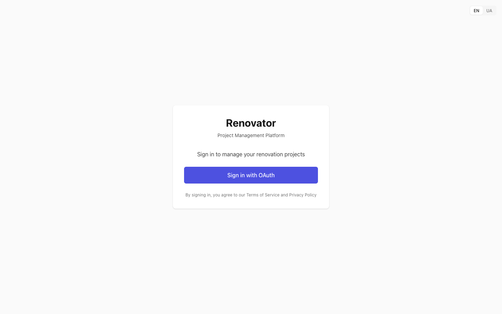
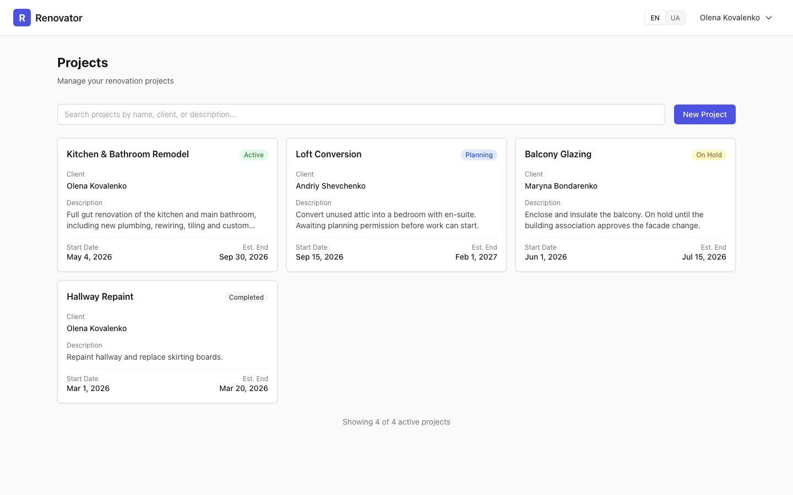
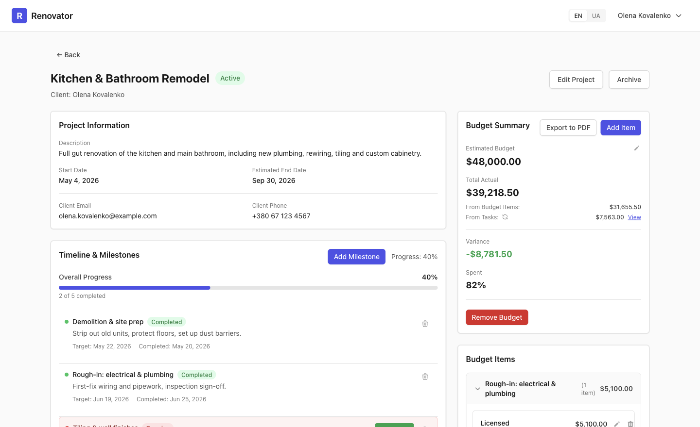
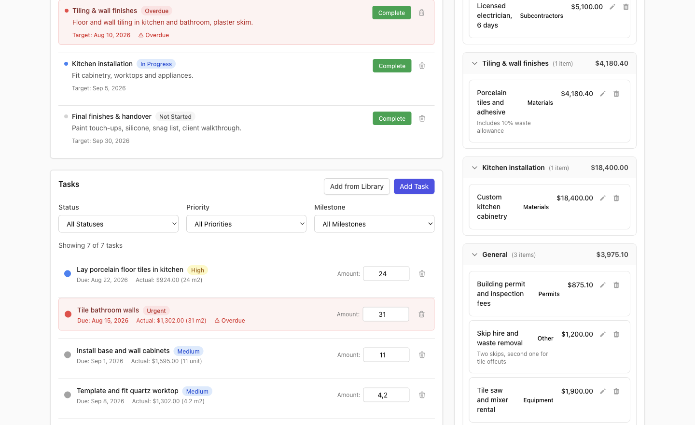
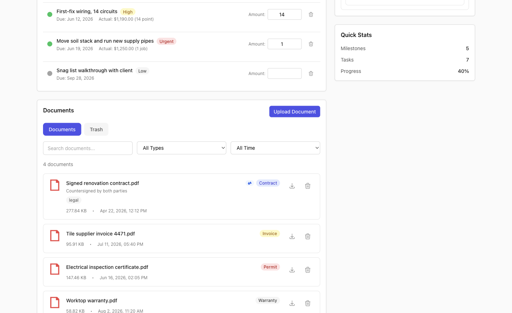
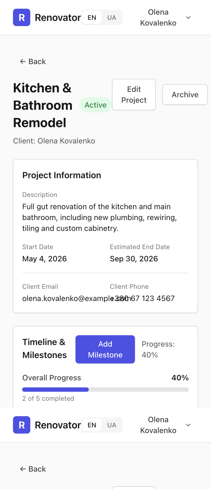
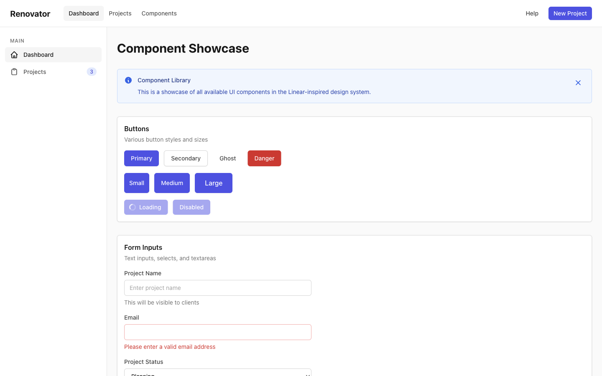
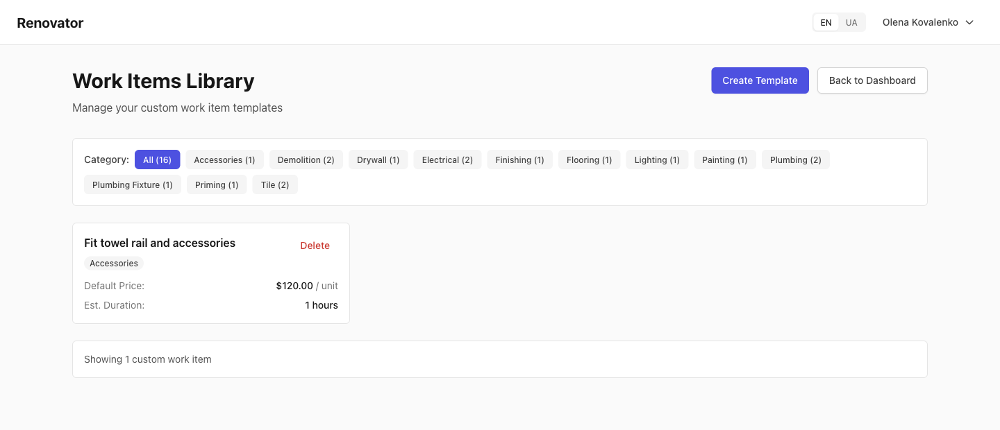

# UX/UI Design Review — Renovator Portal

**Date:** 18 August 2026
**Scope:** `packages/frontend` — design system, IA/navigation, core page flows, domain widgets, responsiveness, content/i18n
**Method:** static review of every file in scope, plus the app run locally at 1440px and 390px with a mocked API layer so real rendered states could be screenshotted (see [Method and caveats](#method-and-caveats)).

### Review parameters you set

| Parameter | Your answer | How it shaped this report |
|---|---|---|
| Visual reference | **Linear** | Density, 1px borders over shadows, sentence case, one accent per view |
| Primary users | **Homeowners, desktop/laptop** | 1440px correctness weighted highest; mobile treated as "must not be broken" |
| Palette | **Fully open** | Recommends regenerating `primary` and adding semantic scales |
| Focus area | **Everything equally** | No area down-weighted |
| Accessibility | **Not a formal target** | Only 3 a11y items included, all of which are plain usability bugs |
| Dark mode | **Not now, but keep tokens ready** | Token-indirection findings included; no theming work proposed |
| Priority | **Polish and IA, clearly separated** | Every item tagged `polish` or `structural`; Quick Wins ship independently |
| Constraints | **No large rewrites** | Two findings exceed this; called out explicitly in [Conflicts](#conflicts-with-your-stated-constraints) |

---

## Executive summary

This is a well-built application with an unusually disciplined foundation that has quietly stopped being used. Someone made deliberate, good decisions early — a border-first visual direction with custom `rounded-linear`/`shadow-linear` tokens, a 12-component UI kit with a genuinely consistent form contract, complete en/uk translation parity, centralised currency formatting, optimistic updates with correct rollback — and then feature work outgrew them. The result is not a messy app; it is a coherent app competing with a second, ad-hoc app that grew on top of it.

Three numbers capture the pattern. `rounded-linear` is used 54 times and the radii it was meant to replace are used 61 times. `Spinner` exists and is bypassed by 9 hand-rolled copies. `Sidebar` and `HeaderNavItem` are fully built, complete with active states, and render on exactly one page — the internal component showcase.

The most consequential finding is not visual. **The application has no navigation.** Every real page hand-rolls a header containing only a logo and an account menu; wayfinding is a set of `← Back` buttons. A whole tested feature (suppliers and materials) has no route at all, and the global work-items library is reachable only from inside the account dropdown.

### Top 3 strengths worth protecting

1. **Translation parity is a solved problem and actively maintained.** 474 keys in both locales, zero missing, zero untranslated placeholders. Ukrainian is treated as a real locale, not a string swap: Kyiv phone area codes, metric units, Ukrainian street conventions, and "milestone" rendered as the natural *Етап* rather than a calque. Your uncommitted change adds a new key to both files in the same edit. Most bilingual codebases at this stage have dozens of gaps.
2. **Zero raw colour literals anywhere in `src`.** No hex, no `rgb()`, no arbitrary `bg-[...]` in any `.tsx` or `.css` file — every literal lives in `tailwind.config.js`. This is unusual discipline and it makes both the palette rework and the eventual dark mode dramatically cheaper.
3. **The form layer is exemplary and should be the model for everything else.** All six `*Form` components share one skeleton: `Modal` + `form` + `ModalFooter`, the same `errors` state shape, clear-error-on-change, secondary Cancel then primary submit, the same create/edit label switch. A new contributor learns it once. Do not refactor this — make the lists follow it.

### Top 3 risks

1. **There is no navigation shell, and no URL state below the project level.** Sidebar and header nav exist but are unused; inside `ProjectDetail` every sub-view is a modal driven by `useState`, so nothing is bookmarkable, refresh loses everything, and Back jumps to the dashboard from three levels deep. For a product where a homeowner wants to send their contractor a link to a milestone, this is a product limitation, not a polish item.
2. **A single failed action destroys the entire project page.** Fourteen separate handlers write into the one `error` state that gates a full-page error takeover. A transient failure while ticking a task checkbox — the highest-frequency interaction on the page — replaces budget, tasks, photos and scroll position with a red banner. The optimistic rollback logic is already correct; only the error *surfacing* is wrong.
3. **Status colour is meaning in this product, and it is encoded ad-hoc in 171 places.** Only `primary` and `gray` are defined as tokens, so every success/warning/danger colour comes from raw Tailwind classes across 25 files, via 8 duplicated status→colour maps that have already drifted (`bg-gray-300` vs `bg-gray-400` for the same "not started yet" state, on the same page). One consequence is already a live bug: every budget category badge renders unstyled.

---

## Prioritized recommendations

Effort: **S** ≈ half a day or less · **M** ≈ one to three days · **L** ≈ more than three days.
Bucket: `polish` = visual/CSS/copy-level · `structural` = new pattern, routing, or component rework.

| # | Issue | Area | Impact | Effort | Bucket | Suggested fix |
|---|---|---|---|---|---|---|
| 1 | Budget category badges render **completely unstyled** — `getCategoryColor` returns `'blue'`/`'green'`/… cast `as any` into a `Badge` that accepts only `default\|primary\|success\|…`, so the class string contains `undefined` | Widgets | High | S | polish | Type the return as `BadgeProps['variant']`, map the 7 categories to real variants, delete the `as any` at `BudgetItemsList.tsx:99` |
| 2 | `TaskDetail` modal is **unreachable** — `setIsTaskDetailOpen(true)` is never called, so per-task notes are dead functionality and clicking a task opens the edit form instead | Flows | High | S | structural | Add `onSelect` to `TaskList`, bind the row click at `TaskList.tsx:279`, pass it from `ProjectDetail.tsx:903` |
| 3 | Any action failure wipes the whole project page — 14 handlers feed the one `error` that gates the full-page takeover at `ProjectDetail.tsx:699` | Flows | High | S | structural | Split `loadError` from `actionError`; render the latter as a dismissible `Alert` under the page header |
| 4 | Pluralization is **silently broken in both locales** — `_plural` suffixes don't exist in i18next v25, so English shows "Add 5 Task" and Ukrainian's three plural forms never render | Content | High | S | structural | Rename to `_one`/`_other` (en) and `_one`/`_few`/`_many`/`_other` (uk); same fix for `workItemsLibrary.hours`, which renders "1 hours" |
| 5 | **No navigation shell.** `Sidebar` + `HeaderNavItem` are built with active states but render only on `/components`; all four real pages hand-roll a logo-and-account header | IA | High | M | structural | Add an `AppShell` layout route rendering `Header` + `Sidebar` once; hoist `ProtectedRoute` into it; delete ~120 duplicated lines from the four pages |
| 6 | **Nothing below the project level is in the URL** — 8 modals and all list filters are local state; Back from a task lands on the dashboard | IA | High | L (S for interim) | structural | Interim: put the active section in a query param via `useSearchParams`. Target: child routes under `projects/:id` with `ProjectDetail` as a shell plus `<Outlet/>` |
| 7 | 42 hardcoded English error strings, and `err.message \|\|` means **77 raw backend messages win** — Ukrainian users see "Invalid encrypted token format" | Content | High | M | structural | Add an `errors` namespace; flip the order so `t('errors.x')` displays and `err.message` only reaches `console.error` |
| 8 | No semantic status tokens — 171 raw palette classes across 25 files, 8 duplicated status→colour maps, already drifted | Design system | High | M | polish | Add `success`/`warning`/`danger`/`info` scales seeded from current values; extract `utils/statusColors.ts`; fix `Badge` and `Alert` first |
| 9 | Suppliers and materials are **fully built, tested, and unreachable** — no route renders `SupplierList`/`ResourceList`/`BudgetOverview` despite complete backend support | IA | High | M | structural | Add a `materials` child route under the project shell and a global `suppliers` route; check whether `BudgetOverview` can replace the hand-rolled budget rail |
| 10 | Client email and phone **visually overlap at 390px** — `grid-cols-2` with no responsive fallback, one of ten such grids | Responsive | High | S | polish | `grid-cols-1 sm:grid-cols-2` on all ten, matching the correct pattern already in `ProjectForm.tsx:319` |
| 11 | Breakpoint ladder stops at `lg` (1024px), so the **stated primary 1440px target gets a 1024px layout**. 13 responsive classes app-wide, zero `xl:` | Responsive | High | S | polish | Add `xl:grid-cols-4` to the Dashboard and library grids; `xl:col-span-3` on the ProjectDetail main column |
| 12 | Form control `id`s are derived from the **translated label**, so duplicate labels produce duplicate ids and clicking a label focuses the wrong field | Responsive/a11y | Med-High | S | polish | Use `React.useId()` as the fallback in `Input`/`Select`/`Textarea`/`Checkbox` — one line each, no API change |
| 13 | No feedback pattern at all — saves are silent, and success/failure uses `window.alert` | Flows | Med-High | M | structural | Add a minimal `ToastProvider` reusing `Alert` styling; wire the money paths first (estimated budget, budget item, budget delete) |
| 14 | Six list/row patterns for one interaction — 3 radii, 3 separation strategies, 4 hover treatments, actions in 3 places | Widgets | Med-High | L | structural | Extract `ListRow` + `IconButton` into `ui/`; migrate one widget per PR starting with `MilestoneList` and `TaskList` |
| 15 | `Alert` hand-rolled in **10** places, `EmptyState` bare text in **5**, `Spinner` bypassed **9** times (4 in an off-palette `border-blue-600`) | Widgets | Med-High | S | structural | Mechanical swap to the existing components; the 4 blue spinners are the priority since `ProtectedRoute` is the first thing every user sees |
| 16 | **Required fields are invisible.** All six forms pass `required`, but the three field primitives never read it | Widgets | Med-High | S | polish | Render a `*` in the label in `Input`/`Select`/`Textarea` — three edits, all six forms improve |
| 17 | Empty states on the two most important panels are a bare grey sentence with no next step, and `EmptyState` is never used inside `ProjectDetail` | Flows | Med-High | M | structural | Swap `MilestoneList`/`TaskList` empties for `EmptyState` with an `action`; add the missing `*Hint` copy keys |
| 18 | Dashboard is a project list, not a dashboard — no totals, no spend, no overdue count, no "next thing due" | Flows | Med-High | M | structural | Add 3–4 stat tiles above the search bar and progress + overdue chips to the cards; may need one backend field |
| 19 | `ProjectDetail` opens with static reference data; money is in a narrow rail and "Quick Stats" is last | Flows | Med | M | structural | Move Quick Stats above Budget Summary and add "next milestone"/"overdue tasks"; demote Project Information to the bottom or a disclosure |
| 20 | **Six competing `primary` buttons** on `ProjectDetail`, while the page-header actions are both secondary and destructive "Remove budget" sits inline at equal weight | Design system | Med | S | polish | Demote the per-section adds to `secondary`; move "Remove budget" out of the card body |
| 21 | 58% of English copy is **Title Case** against a sentence-case reference. Ukrainian is already correctly sentence case | Content | Med | M | polish | One mechanical `en.json`-only commit; no code touched |
| 22 | Core nouns are contractor jargon — "Work Items Library", "Resources", "Variance", "Budget Items" | Content | Med | S–M | polish | "Work catalog", "Materials & equipment", "Left", "Costs" — labels only, data model unchanged |
| 23 | `overflow-x-hidden` on `<main>` **hides** mobile overflow rather than fixing it | Responsive | Med | S | polish | Remove it while fixing #10 so real overflow surfaces in review |
| 24 | `Modal` has no max-height, so titles and Save buttons scroll off the four long forms | Responsive | Med | M | polish | `max-h-[calc(100vh-2rem)] flex flex-col` on the panel, `flex-1 overflow-y-auto` on the content — fixes all 11 modals at once |
| 25 | 10 destructive actions use native `window.confirm`, including deleting a budget; all open with "Are you sure you want to…" | Flows/Widgets | Med | M | structural | `ConfirmDialog` over the existing `Modal`; lead with the consequence ("N tasks will be unassigned") |
| 26 | `primary` scale has its largest hue jump exactly between the 600 fill and the 500 focus ring that `Button` pairs; `primary-50`/`100` are used once each | Design system | Med | S | polish | Regenerate at a fixed hue; use `primary-50/100` for selected and active nav surfaces currently on `bg-gray-100` |
| 27 | Focus uses `focus:` not `focus-visible:`, so mouse clicks leave rings stuck; `Alert`'s dismiss ring falls back to an off-palette Tailwind blue | Design system | Med | S | polish | Set `ringColor.DEFAULT` in config (fixes `Alert` without touching it) and switch the kit to `focus-visible:` |
| 28 | Date formatting duplicated 9× across two APIs with divergent options — the same task reads "Mar 13" in the list and "March 13" in its own detail modal | Widgets | Med | S | structural | `utils/date.ts` mirroring the correct `startsWith('uk')` logic already in `utils/currency.ts` |
| 29 | Work Items Library filters say `All (16)` while the list says `Showing 1 custom work item` — counts include 15 built-ins that are never displayed | Flows | Med | S | polish | Either count only what's shown, or show the built-in templates (they're only visible in the modal today) |
| 30 | Login says nothing about the product and its button reads **"Sign in with OAuth"** | Flows | Med | S | polish | "Continue with Google" + glyph, one line of product copy, `loading` state, and switch `rounded-lg shadow` → the `linear` tokens |
| 31 | Editing a project from inside it returns you to the **dashboard**, on both save and cancel | IA | Med | S | polish | Branch on `isEditMode` → `/projects/${id}`; `navigate(-1)` on cancel |
| 32 | Nav components use raw `<a href>`, so the moment they're wired up every click is a full page reload | IA | Med | S | structural | Swap to `NavLink` and derive `active` from `isActive` — do this *before* #5 |
| 33 | No `active:` pressed state anywhere in the app | Design system | Low-Med | S | polish | Add `active:` fills and `active:scale-[0.98]` to `Button`; optionally set `transitionDuration.DEFAULT: 120ms` |
| 34 | Two error fallbacks display the word **"Retry"** as the error message | Content | Low-Med | S | polish | `BudgetItemForm.tsx:184` and `MilestoneForm.tsx:131` — one line each |
| 35 | File size shown unscaled: a 12 MB photo reads `12288.00 KB`, right where the user decides whether to upload | Widgets | Low-Med | S | polish | Move the correct `formatFileSize` out of `DocumentList` into `utils/format.ts` and use it in both upload previews |
| 36 | `rounded-linear` (54) is outnumbered by the radii it replaced (61); `shadow-linear` used twice against 13 stock shadows, and `Card` layers `hover:shadow-md` on its own hairline | Design system | Low-Med | S | polish | Set `borderRadius.DEFAULT: '6px'` (converts 20 uses with zero edits); swap `hover:shadow-md` for `hover:border-gray-300`; drop `shadow-sm` from `Button` |
| 37 | Mobile has no navigation, and `Sidebar` has no narrow-width behaviour — it will steal 256px the moment #5 ships | Responsive | Low-Med | M | structural | Ship `hidden lg:block` + a drawer and hamburger **in the same change as #5**, not after |
| 38 | Overdue rows add a 1px border that normal rows lack, so mixed lists have misaligned content; overdue is signalled three ways in-row | Widgets | Low | S | polish | `border border-transparent` on normal rows; reduce to tint + `⚠`; lift `ResourceList`'s aggregate-Alert pattern into tasks and milestones |
| 39 | `ResourceList` is read-only with no create/edit/delete, despite a complete `ResourceForm` existing — the feature is unreachable from its own UI | Widgets | Low | M | structural | Mirror `SupplierList` exactly; also switch its raw `fetch` to `apiClient` |
| 40 | `ProjectForm` validates only on submit and finds the first error by querying for a Tailwind class (`[class*="text-red-600"]`), which can match the error banner | Flows | Low | S | structural | Refs keyed by field name; add `onBlur` for email and the date pair; swap the hand-rolled banner for `Alert` |
| 41 | Unsaved form changes are discarded silently — no `beforeunload`, no dirty check, and the account menu is live on the form page | Flows | Low | S | structural | Track `isDirty` and guard cancel with the `ConfirmDialog` from #25 |
| 42 | `/components` ships to production, and the 404 page has no link home | IA | Low | S | polish | Gate the route behind `import.meta.env.DEV`; give `NotFound` the shell and a primary link |

---

## Quick wins

Low effort, high impact, no new patterns. These are independent of each other and of any IA work — a sensible first pass.

**Live bugs (half a day total)**
- Type `getCategoryColor` and delete the `as any` — restores every budget category badge (#1).
- Rename the `_plural` keys and add plural forms for `hours` — removes "Add 5 Task" and "1 hours" (#4).
- Fix the two error fallbacks that print "Retry" (#34).
- `useId()` in the four form primitives — removes duplicate-id label misdirection (#12).
- `grid-cols-1 sm:grid-cols-2` on the ten unguarded grids — fixes the overlapping email/phone (#10).

**Token and config changes that fix many files at once (half a day)**
- `borderRadius.DEFAULT: '6px'` — converts 20 stray `rounded` uses without touching a file (#36).
- `ringColor.DEFAULT: primary-500` — fixes `Alert`'s off-palette blue ring without touching `Alert` (#27).
- Delete the four redundant `boxShadow` overrides that duplicate stock Tailwind (#36).
- `px-4 sm:px-6 py-6 sm:py-8` in `Container` — recovers 12% of width on a phone (#23).
- `xl:grid-cols-4` on two grids — gives 1440px a layout of its own (#11).

**Mechanical component swaps (one day)**
- Replace the 10 hand-rolled red error divs with `Alert`, the 9 hand-rolled spinners with `Spinner`, the 5 bare empty states with `EmptyState` (#15).
- Render `*` for `required` in the three field primitives (#16).
- Demote the six competing primaries and relocate "Remove budget" (#20).
- Add `active:` states to `Button` (#33).

**Copy (one day, no code)**
- Sentence-case pass over `en.json` (#21).
- Rename the four jargon nouns (#22).
- "Continue with Google" plus one line of product copy on Login (#30).
- Add the two missing empty-state hint keys (#17).

---

## Bigger investments

These need design decisions or touch routing. Roughly in dependency order.

**1. Introduce the app shell — and fix the nav components first.** `NavLink` before `AppShell` (#32 then #5), with the mobile drawer in the same change (#37). This is the highest-leverage structural work: it deletes ~120 duplicated lines, gives every page a consistent frame, and finally exposes the library (#22) and the unreachable materials feature (#9) as real destinations. It also unblocks breadcrumbs and per-page `document.title`.

**2. Put project sub-state in the URL.** Start with the query-param interim (S) to make refresh and Back behave, then move to child routes under `projects/:id` (#6). Each existing card body becomes a route element largely unchanged, so this is a re-parenting exercise rather than a rewrite — but it is the item most in tension with your no-rewrites constraint, so stage it deliberately.

**3. Extract the four missing primitives.** `ListRow`, `IconButton`, `ConfirmDialog`, `utils/date` (#14, #25, #28). The UI kit currently stops at the field level, which is exactly why six sibling lists diverged while all six forms agree. Migrate one widget per PR.

**4. Add a feedback layer.** A minimal toast provider (#13) plus splitting page-level from action-level errors (#3). Together these change how the app *feels* more than any amount of CSS — right now a successful save and a failed save are both silent.

**5. Rework the landing and project hierarchy.** Make the Dashboard answer "what needs my attention" (#18) and reorder `ProjectDetail` so money and next actions come before static reference data (#19). This needs your product judgement about what a homeowner checks daily, so it's worth a short design conversation rather than a direct implementation.

**6. Regenerate the palette and add semantic scales.** Since the palette is open (#8, #26): fix the hue break, keep 600 as the anchor so buttons look unchanged, and add the four status scales seeded from current values so the visual diff is near zero. Doing this before the next ten features is much cheaper than after.

---

## Evidence

### Login — the entire first impression

A centred card on an empty field. There is no product explanation, no brand mark (the "R" tile used elsewhere is absent), and the primary button reads **"Sign in with OAuth"** — the protocol name, where a homeowner expects a provider they recognise. The language switcher floats top-right with no header to sit in. This page also uses `rounded-lg shadow` while the rest of the app uses the `linear` tokens, so the first screen is off-system. There is no pending state on the button and no error state on the page at all (#30).

### Dashboard — a list, not a dashboard

Note what is absent: no navigation of any kind, no aggregate figures, no progress, no overdue signal. The four cards spend their space on labels — "Client", "Description", "Start Date", "Est. End" carry as much visual weight as the values they describe — while the questions a homeowner actually has ("is anything late?", "how much have I spent?") require clicking through. `Est. End` is also an abbreviation the copy doesn't need. The grid caps at three columns, so 1440px yields ~410px cards holding five short fields (#11, #18).

### ProjectDetail — 97 interactive elements on one 2,953px page

The measured page has 72 buttons, **22 of them "Delete"**, and 47 inline SVGs. Several things are visible here:

- **"Remove budget" is a saturated red button given permanent prime position** in the rail — the highest-contrast element on the screen is the most destructive and least frequent action (#20).
- **"Variance −$8,781.50" is rendered in green.** Being under budget is good news displayed as a negative number in a positive colour; "Variance" is also finance vocabulary (#22).
- **"Spent 82%" is a bare number** while milestones directly above get a real progress bar — the same concept, two treatments.
- The estimated-budget edit affordance is a 14px pencil at the far right of the label row, and its save/cancel are unlabelled glyphs (#27, and the icon-name gap in the a11y items).
- The left column has generous unused width while the rail is cramped enough to wrap "Licensed electrician, 6 days" onto three lines — space allocation is inverted relative to information density.

The task rows show the density problem concretely. Task metadata sits hard left, the `Amount:` label and input hard right, with a large void between — and `Amount:` repeats on all seven rows. Note the quartz worktop row: the row text reads `Actual: $1,302.00 (4.2 m2)` with a decimal point while the input beside it shows `4,2` with a comma — two decimal separators in one row. The three status/priority/milestone filters are a third distinct filter pattern (the Dashboard has search only; Documents has search plus two selects). Green "Complete" buttons, indigo "Add task", and red "Remove budget" put three competing button colours in one viewport.

Category badges in the rail — "Materials", "Subcontractors", "Permits", "Other", "Equipment" — render as bare text with no fill. That is finding #1 visible: the variant lookup misses, so the class string contains `undefined`.

"Documents / Trash" pill tabs are a segmented control that doesn't exist in the UI kit, and Trash is promoted to a top-level tab. Document type badges use semantic colours decoratively — Permit is red, which reads as an error. The right column ends well before the left, leaving a large empty gutter. "Quick Stats" contributes three numbers, one of which (Progress 40%) already appears twice higher on the page.

### Mobile at 390px — two real rendering bugs

There is no horizontal overflow, but that is because `overflow-x-hidden` on `<main>` clips it (#23). Visible breakage:

1. **Client email and phone overlap** — `olena.kovalenko@example.c…` collides with `+380 67 123 4567`. This is `grid-cols-2` with no responsive fallback at `ProjectDetail.tsx:831` (#10).
2. **The title collides with its actions** — "Kitchen & Bathroom Remodel" wraps to three lines, the `Active` badge lands mid-title, and "Edit Project"/"Archive" overlap the heading because `flex items-start justify-between` never stacks.
3. **"Timeline & Milestones" collides with "Add Milestone"** and "Progress: 40%" — `CardHeader` actions don't wrap.
4. The header crams logo, wordmark, language switcher and a two-line user name onto one row, with no separation and no nav.

The page is 6,213px tall on mobile — over seven screens for one project.

### Component showcase — the navigation that exists but isn't used

This is the only page that renders the shell: a left rail with icons and a count badge, top nav with a clear active pill, and a header action area. It looks good, and no real page uses it (#5). The alert text reads *"a showcase of all available UI components in the Linear-inspired design system"* — the aspiration you named is already documented in the code.

Two component-level notes: `Ghost` has no border or background, so it reads as plain text rather than a button; and `Loading` and `Disabled` are visually near-identical, distinguished only by a small spinner. The form column is also constrained to ~320px inputs on a 1440px screen.

### Work Items Library — contradictory counts

The filters total `All (16)` while the footer reads `Showing 1 custom work item`: the counts include 15 built-in templates that this page deliberately filters out and that are only visible inside the modal (#29). Also here: `Est. Duration: 1 hours` (#4), a bare red "Delete" text link as a fourth destructive pattern, a header with no logo mark unlike every other page, "Back to Dashboard" as a button rather than back-navigation, and a single ~280px card in a 1440px viewport.

---

## Conflicts with your stated constraints

**1. "No large rewrites" vs. URL state (#6).** Making project sub-views linkable genuinely cannot be done as a CSS-level change — `ProjectDetail` is 1,339 lines with 32 `useState` hooks and 8 modals, and none of it touches the router. I've staged it so the cheap interim (query param for the active section, S effort) delivers working refresh and Back without restructuring, and the child-route version can follow when you're ready. But if the constraint is firm, the honest position is that bookmarking and link-sharing stay broken. Given the domain — a homeowner wanting to send a contractor a link to a milestone — I'd argue this one is worth relaxing the constraint for.

**2. "No large rewrites" vs. the six list patterns (#14).** Extracting `ListRow` and migrating six widgets is L effort. It is genuinely optional: the quick-win swaps (#15, #16, #38) close most of the *visible* gap between these lists at S effort each. I'd treat the extraction as deferrable and reassess after the quick wins land.

**3. Accessibility de-scoped, but three findings are plain usability bugs.** You marked a11y out of scope and I've kept it to three items, all of which a sighted mouse user hits: the label-derived `id` collisions cause clicking a label to focus the *wrong field*, possibly behind a modal (#12); `Modal`'s close button has no name at all; and two unlabelled inline save/cancel glyphs sit where the user has just typed a number and must guess which commits it. These are in the report as usability, not compliance. The larger a11y surface — focus trapping, ARIA roles, contrast — is deliberately excluded.

**4. Linear reference vs. current copy.** 153 of 264 English label strings are Title Case, which is the single largest deviation from the reference and the cheapest to fix. Worth noting the direction of the gap: **the Ukrainian build already matches your Linear aspiration better than the English one**, because Ukrainian has no Title Case and `uk.json` is uniformly sentence case.

**5. Desktop-first for homeowners vs. the breakpoint ladder.** You identified 1440px laptops as the primary target, but the app has 13 responsive classes total and zero `xl:`/`2xl:` — the last breakpoint used anywhere is `lg` (1024px). Your primary audience currently sees a layout designed for an iPad. This is the clearest mismatch between stated priority and current code, and it's also an S-effort fix.

**6. Dark mode "not now, but keep tokens ready" — mostly on track, one gap.** No raw colour literals anywhere is exactly the right position. The remaining gap is ~50 direct surface classes (`bg-white`, `bg-black/60`) with no token indirection, plus a 12-line `index.css` with no `@layer base` or custom properties. Adding `surface`/`canvas`/`border-subtle` aliases now is cheap; the 171 raw status classes in #8 are the real future blocker, which is another reason to do #8 early.

**7. One thing you may not have known you were choosing.** The suppliers/materials feature (#9) is fully implemented, tested, and has complete backend routes — it simply has no route in the frontend. That's finished work no user can reach, and it changes the IA conversation: any navigation design that omits materials will look correct against the current UI while contradicting the data model.

---

## Method and caveats

- **Six parallel scoped analyses** covered the design system and tokens, IA and routing, core page flows, domain widgets, responsiveness, and content/i18n. Findings were cross-checked against each other; where counts differed because scopes differed, this report uses the app-wide figure.
- **The app was run locally** (`vite` on port 5199) and screenshotted at 1440×900 and 390×844 via CDP. Because every route except `/login` sits behind Keycloak and no backend was available, a mock API layer was injected into the browser page context to render the authenticated pages. **No application code was modified.** The mock data is fabricated (a fictional kitchen/bathroom remodel) and contains no real credentials.
- **Two findings are mock-independent but worth restating as such:** the `All (16)` vs `Showing 1` contradiction and `1 hours` both follow from real code paths (`WorkItemsLibrary.tsx:80` filters out defaults while the category counts don't; `workItemsLibrary.hours` has no plural forms) and were verified in source, not inferred from the screenshot.
- **Not covered:** backend API design, performance and bundle size, test quality, and the Google Drive integration flows beyond their callback screens.
- **Screenshots** live in `docs/ux-review/`.
